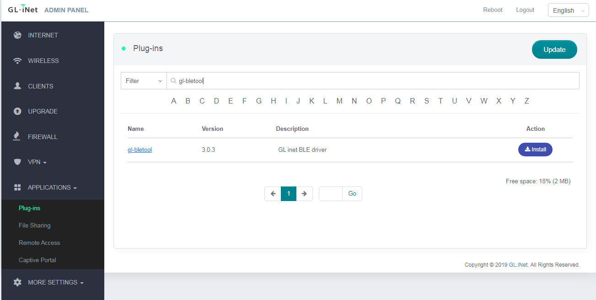
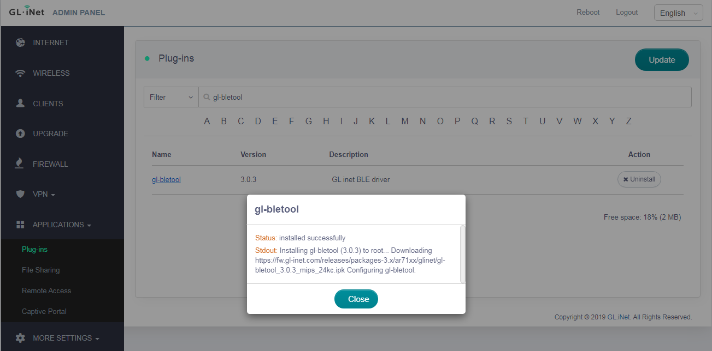
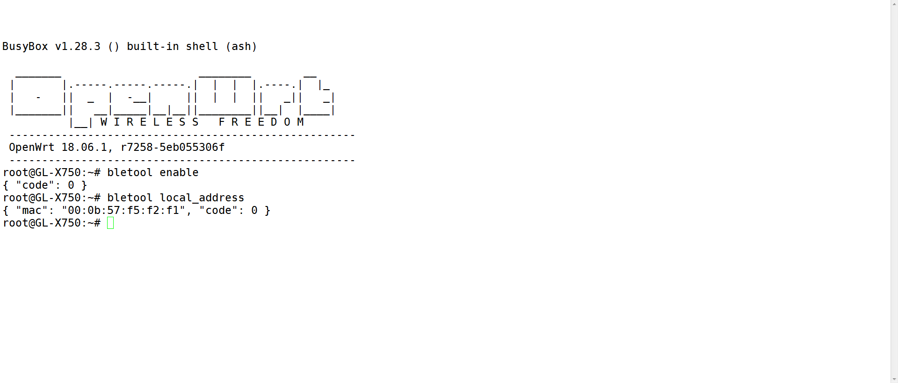

# bletool

BleTool is a software develop kit for Bluetooth Low Energy (BLE) in GL-iNET’s products. It provides a basic and simple method for developers to operate all the BLE functions. 
Different from BlueZ which includes the full Bluetooth protocol stack in the host system, bletool is a light weight tool to operate hostless BLE modules which has fully built-in protocol stack. The module can fully operate on itself rather than depending on the host system.
To use BleTool, you need to have one of the following devices.

- GL-S1300 (Convexa-S): Smarthome gateway with beamforming Wi-Fi
- GL-X750 (Spitz): LTE IoT gateway
- GL-XE300 (MEET PULI): Portable 4G LTE WiFi Hotspot with Security Features
- GL-MT300N-V2: (Mini Smart Router): Converting a public network (wired/wireless) to a private Wi-Fi for secure surfing.
- Gl-E750 (MEET MUDI): 4G LTE Privacy Router for Road Warriors
- GL-X300B (MEET COLLIE): 4G LTE Industrial Wireless Gateway
- GL-AP1300 (MEET CIRRUS): Enterprise Ceiling Wireless Access Point
- GL-B2200 (Velica): Whole home mesh system and gateway

You can also use BleTool if you use Silconlabs EFR32 BLE modules which use UART/SPI to connect to your host Linux.

## how to install

By default, BleTool is not installed on your router. You can install it using opkg if you can ssh to the router.

```
opkg update
opkg install gl-bletool
```
Alternatively, you can install using the web UI. Login your router’s web UI using your browser which is http://192.168.8.1 by default. Then go to APPLICATIONS->Plug-ins. First click “Update” to refresh your software repo then search “gl-bletool”. Click “install” and wait until you got “installation successfully”.




## how to use

BleTool provides the following elements to handle BLE advertising, connection and GATT services.

- C/C++ APIs: This includes C functions, C header files based on which you can write your own code.
- C/C++ library: You can link this library with your own C application. You need to include the C header files in your own code to compile. 
- cli (command line) tools: cli is commands that you can run in Linux terminal. You can use cli tools to test your BLE applications quickly and easily.
Here is example of how to use cli commands.



## API Reference

Look at the [Bletool manual](https://dev.gl-inet.com/bletool/group__user). It contains all detail about the API and CLI.

## Directory Structure

```cpp
|—— LICENSE
|
|—— Makefile
|
|—— VERSION_FILE
|
|—— README.md
|
|—— docs								        # document
|
|—— files
|	|—— gl_bletool.init					        # configuration file
|
|—— src
    | 	|—— components
    |   |   |—— dev_mgr
    |	    |—— log
    |
    |—— daemon 							        # ble daemon
    |   |—— gl_daemon.c
    |   |—— bledriver
    |       |——silabs					        # silabs SDK
    |       |——util 					        # utilities   
    |
    |—— include                    		        # header file
        |—— gl_errno.h
    |   |—— gl_type.h
    |
    |—— lib                        		        # ble api lib
    |   |—— gl_bleapi.h
    |   |—— gl_bleapi.c
    |
    |—— project                			        # user application file
    |   |—— gl_demo.c	     				    # demo file
    |
    |—— tool                     	
    |   |—— gl_cli.c						    # debug tool – bletool
    |
    |—— Makefile
```